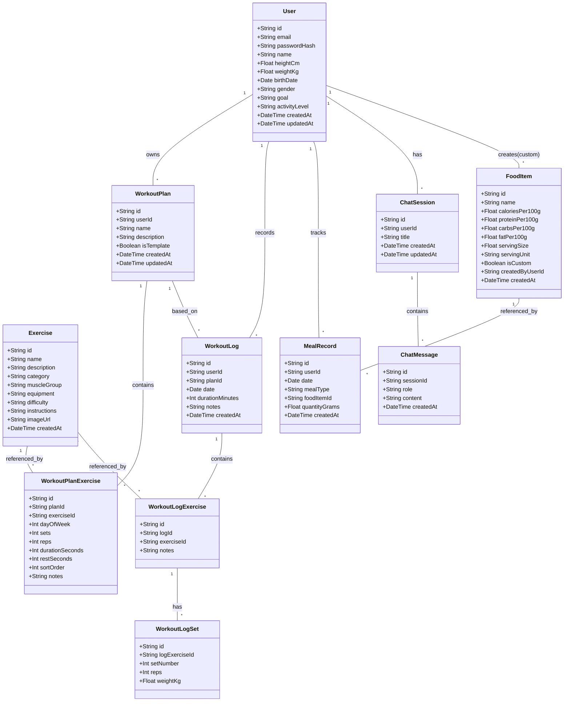
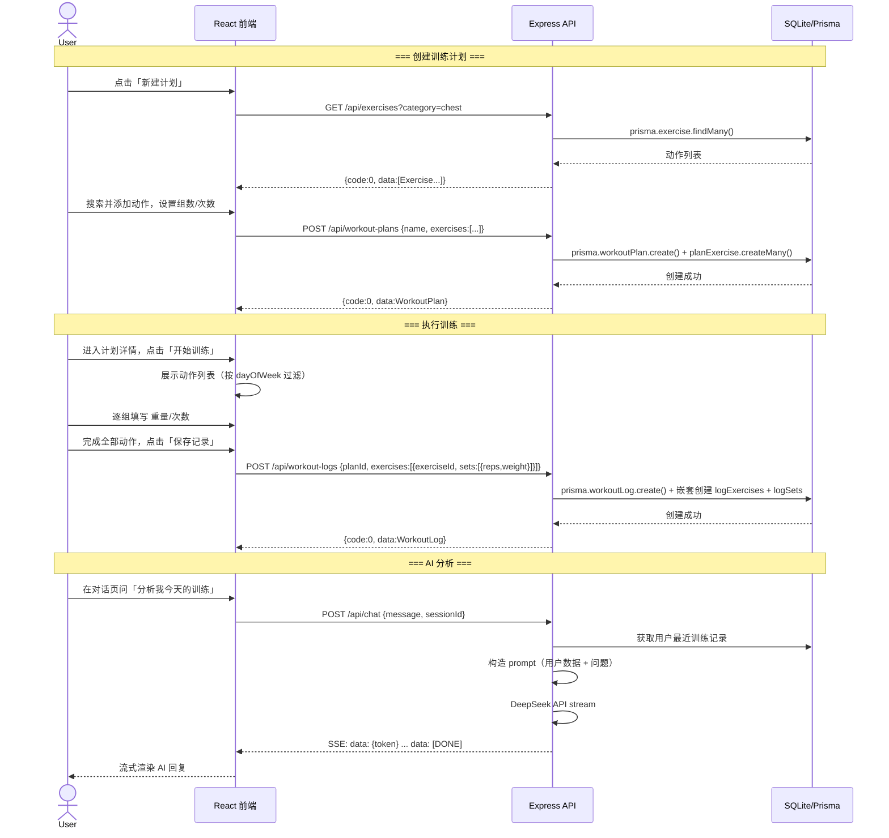
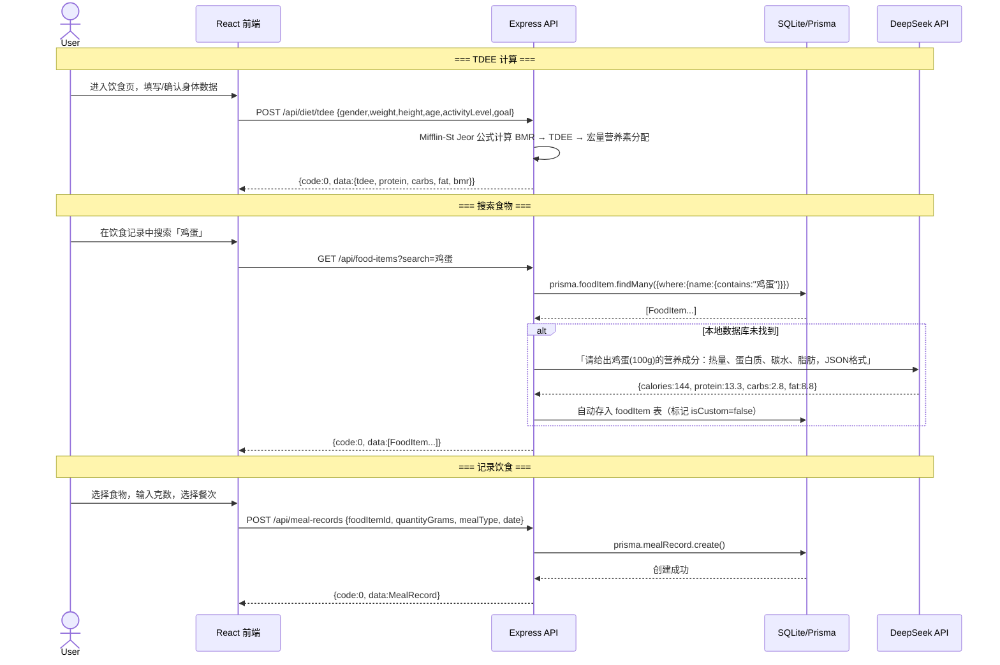
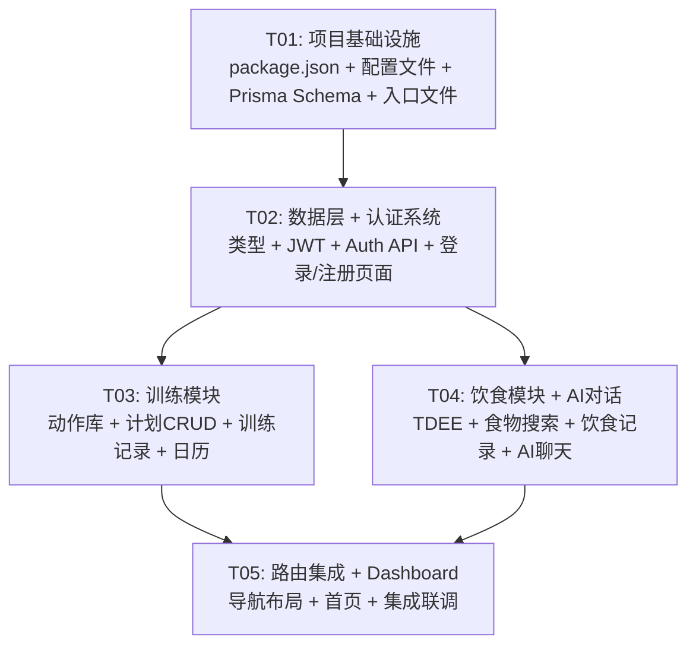

# 健身APP — 系统架构设计文档

> 架构师：Bob（高见远）
> 日期：2026-05-24

---

## Part A: 系统设计

---

### 1. 实现方案

#### 1.1 核心技术挑战

| 挑战 | 分析 | 方案 |
|------|------|------|
| AI 对话体验 | 需要流式响应，前端需处理 SSE/stream | DeepSeek API stream mode + EventSource |
| 训练计划结构化 | 计划-动作-组的嵌套关系复杂 | Prisma 关联查询 + 前端 normalize |
| 饮食计算准确性 | TDEE 公式多样，食物数据来源不统一 | 后端统一计算逻辑 + DeepSeek 补全营养数据 |
| 多设备支持 | 需要服务端持久化 | Express REST API + 数据库 |

#### 1.2 框架选型

| 层 | 选型 | 理由 |
|----|------|------|
| 前端框架 | React 18 + TypeScript | 团队选型，生态丰富 |
| 构建工具 | Vite 5 | 极速 HMR，零配置 |
| UI 组件库 | MUI v5 | Material Design，丰富组件 |
| 样式 | Tailwind CSS 3 | 原子化 CSS，与 MUI 互补 |
| 状态管理 | Zustand | 轻量（<1KB），无 boilerplate |
| 路由 | React Router v6 | 标准选择，支持 layout route |
| HTTP 客户端 | Axios | 拦截器支持，比 fetch 方便 |
| 后端框架 | Express 4 + TypeScript | 成熟稳定，社区最大 |
| ORM | Prisma 5 | 类型安全，迁移工具完善 |
| 数据库 | SQLite (MVP) | 零配置部署，Prisma 无缝迁移至 PG |
| 认证 | JWT (jsonwebtoken) | 无状态，适合 REST API |
| 密码加密 | bcryptjs | 纯 JS 实现，跨平台 |
| 校验 | zod | TypeScript-first schema validation |
| AI | DeepSeek API | 中文友好，用户已有 Key |
| 日期处理 | date-fns | tree-shakeable，轻量 |

#### 1.3 架构模式

```
┌─────────────────────────────────────┐
│            前端 (SPA)                │
│  Vite + React + MUI + Tailwind      │
│                                     │
│  pages/ ←→ components/ ←→ store/    │
│                ↕                    │
│             api/ (Axios)            │
└────────────────┬────────────────────┘
                 │ HTTP REST + JWT
┌────────────────┴────────────────────┐
│         后端 (Node.js)               │
│                                     │
│  routes/ → services/ → prisma/      │
│                ↓                    │
│         DeepSeek API (AI)           │
└────────────────┬────────────────────┘
                 │
┌────────────────┴────────────────────┐
│          SQLite 数据库               │
│    (Prisma ORM 管理)                 │
└─────────────────────────────────────┘
```

**模式**：前后端分离的 MVC 变体（后端 routes = Controller, services = Model/Logic, 前端 pages = View）

---

### 2. 文件列表

```
project-root/
│
├── client/                          # 前端项目
│   ├── index.html
│   ├── package.json
│   ├── vite.config.ts
│   ├── tailwind.config.ts
│   ├── postcss.config.js
│   ├── tsconfig.json
│   ├── tsconfig.node.json
│   ├── .env.example
│   └── src/
│       ├── main.tsx                 # 入口
│       ├── App.tsx                  # 路由 + 全局 Provider
│       ├── index.css                # Tailwind 指令 + 全局样式
│       ├── vite-env.d.ts
│       │
│       ├── api/                     # API 请求层
│       │   ├── client.ts            # Axios 实例 + 拦截器
│       │   ├── auth.ts              # 认证 API
│       │   ├── exercises.ts         # 动作库 API
│       │   ├── workouts.ts          # 训练计划/记录 API
│       │   ├── diet.ts              # 饮食 API
│       │   └── chat.ts              # AI 对话 API
│       │
│       ├── store/                   # Zustand 状态管理
│       │   ├── authStore.ts
│       │   ├── workoutStore.ts
│       │   └── dietStore.ts
│       │
│       ├── hooks/                   # 自定义 Hooks
│       │   ├── useAuth.ts
│       │   ├── useExercises.ts
│       │   ├── useWorkouts.ts
│       │   └── useDiet.ts
│       │
│       ├── types/                   # TypeScript 类型
│       │   └── index.ts
│       │
│       ├── utils/                   # 工具函数
│       │   ├── format.ts            # 日期/数字格式化
│       │   └── validation.ts        # 表单校验规则
│       │
│       ├── components/              # 可复用组件
│       │   ├── layout/
│       │   │   ├── AppLayout.tsx     # 主布局（含 BottomNav）
│       │   │   └── BottomNav.tsx     # 底部五 Tab 导航
│       │   ├── auth/
│       │   │   ├── LoginForm.tsx
│       │   │   └── RegisterForm.tsx
│       │   ├── workout/
│       │   │   ├── PlanCard.tsx      # 计划卡片
│       │   │   ├── PlanForm.tsx      # 计划创建/编辑表单
│       │   │   ├── ExerciseCard.tsx  # 动作卡片
│       │   │   ├── LogForm.tsx       # 训练记录表单
│       │   │   └── CalendarView.tsx  # 训练日历视图
│       │   ├── diet/
│       │   │   ├── TDEECalculator.tsx
│       │   │   ├── MealRecordForm.tsx
│       │   │   ├── MealRecordList.tsx
│       │   │   └── FoodSearch.tsx
│       │   ├── chat/
│       │   │   ├── ChatWindow.tsx
│       │   │   ├── ChatBubble.tsx
│       │   │   └── ChatInput.tsx
│       │   └── common/
│       │       ├── LoadingSpinner.tsx
│       │       ├── ErrorAlert.tsx
│       │       └── EmptyState.tsx
│       │
│       └── pages/                   # 页面组件
│           ├── LoginPage.tsx
│           ├── RegisterPage.tsx
│           ├── ProfilePage.tsx
│           ├── DashboardPage.tsx
│           ├── WorkoutPlansPage.tsx
│           ├── WorkoutPlanDetailPage.tsx
│           ├── WorkoutLogPage.tsx
│           ├── ExerciseLibraryPage.tsx
│           ├── ExerciseDetailPage.tsx
│           ├── DietPage.tsx
│           └── ChatPage.tsx
│
├── server/                          # 后端项目
│   ├── package.json
│   ├── tsconfig.json
│   ├── .env.example
│   ├── nodemon.json
│   ├── prisma/
│   │   ├── schema.prisma            # 数据库模型定义
│   │   └── seed.ts                  # 种子数据（预设动作库）
│   └── src/
│       ├── index.ts                 # 服务入口
│       ├── app.ts                   # Express 应用配置
│       ├── config/
│       │   └── index.ts             # 环境变量 + 常量
│       ├── middleware/
│       │   ├── auth.ts              # JWT 验证中间件
│       │   ├── errorHandler.ts      # 全局错误处理
│       │   └── validate.ts          # Zod 校验中间件
│       ├── routes/
│       │   ├── auth.ts              # /api/auth/*
│       │   ├── exercises.ts         # /api/exercises/*
│       │   ├── workoutPlans.ts      # /api/workout-plans/*
│       │   ├── workoutLogs.ts       # /api/workout-logs/*
│       │   ├── diet.ts              # /api/diet/*, /api/food-items/*, /api/meal-records/*
│       │   └── chat.ts              # /api/chat/*
│       ├── services/
│       │   ├── authService.ts
│       │   ├── exerciseService.ts
│       │   ├── workoutService.ts
│       │   ├── dietService.ts
│       │   └── aiService.ts         # DeepSeek API 封装
│       ├── utils/
│       │   ├── jwt.ts               # JWT 签发/验证
│       │   └── response.ts          # 统一响应格式
│       └── types/
│           └── index.ts
```

---

### 3. 数据结构和接口

#### 3.1 类图 — 数据模型



#### 3.2 REST API 接口列表

```
┌──────────────────────────────────────────────────────────────────────┐
│  Auth — /api/auth                                                    │
├──────────┬────────┬──────────────────────────────────────────────────┤
│ POST     │ /register   │ 注册（email, password, name）               │
│ POST     │ /login      │ 登录，返回 JWT token                        │
│ GET      │ /me         │ 获取当前用户信息 [需认证]                   │
│ PUT      │ /profile    │ 更新个人信息（身高体重目标等）[需认证]      │
├──────────┴────────┴──────────────────────────────────────────────────┤
│  Exercises — /api/exercises                                          │
├──────────┬────────┬──────────────────────────────────────────────────┤
│ GET      │ /           │ 动作列表（?category=&muscle=&search=&page=） │
│ GET      │ /:id        │ 动作详情                                    │
├──────────┴────────┴──────────────────────────────────────────────────┤
│  Workout Plans — /api/workout-plans   [全部需认证]                    │
├──────────┬────────┬──────────────────────────────────────────────────┤
│ GET      │ /           │ 当前用户的计划列表                          │
│ POST     │ /           │ 创建新计划                                  │
│ GET      │ /:id        │ 计划详情（含关联动作）                      │
│ PUT      │ /:id        │ 更新计划                                    │
│ DELETE   │ /:id        │ 删除计划                                    │
├──────────┴────────┴──────────────────────────────────────────────────┤
│  Workout Logs — /api/workout-logs     [全部需认证]                    │
├──────────┬────────┬──────────────────────────────────────────────────┤
│ GET      │ /           │ 训练记录列表（?date=&from=&to=）            │
│ POST     │ /           │ 创建训练记录（含每组数据）                  │
│ GET      │ /:id        │ 训练记录详情                                │
│ PUT      │ /:id        │ 更新训练记录                                │
├──────────┴────────┴──────────────────────────────────────────────────┤
│  Diet — /api/diet   [全部需认证]                                     │
├──────────┬────────┬──────────────────────────────────────────────────┤
│ POST     │ /tdee       │ 计算 TDEE（接收身体数据，返回营养素分配）   │
├──────────┴────────┴──────────────────────────────────────────────────┤
│  Food Items — /api/food-items   [全部需认证]                         │
├──────────┬────────┬──────────────────────────────────────────────────┤
│ GET      │ /           │ 搜索食物（?search=&page=）                  │
│ POST     │ /           │ 自定义添加食物                              │
├──────────┴────────┴──────────────────────────────────────────────────┤
│  Meal Records — /api/meal-records   [全部需认证]                     │
├──────────┬────────┬──────────────────────────────────────────────────┤
│ GET      │ /           │ 饮食记录列表（?date=）                      │
│ POST     │ /           │ 添加饮食记录                                │
│ DELETE   │ /:id        │ 删除饮食记录                                │
├──────────┴────────┴──────────────────────────────────────────────────┤
│  Chat — /api/chat   [全部需认证]                                     │
├──────────┬────────┬──────────────────────────────────────────────────┤
│ GET      │ /sessions       │ 对话历史列表                            │
│ POST     │ /sessions       │ 创建新对话                              │
│ GET      │ /sessions/:id   │ 获取对话消息列表                        │
│ POST     │ /               │ 发送消息（SSE 流式返回 AI 回复）       │
└──────────┴────────┴──────────────────────────────────────────────────┘
```

---

### 4. 程序调用流程

#### 4.1 核心流程一：创建训练计划 → 执行训练 → 记录



#### 4.2 核心流程二：TDEE 计算 → 饮食记录



#### 4.3 核心流程三：AI 对话（含上下文注入）

```mermaid
sequenceDiagram
    actor User
    participant React as React 前端
    participant API as Express API
    participant DB as SQLite/Prisma
    participant DeepSeek as DeepSeek API

    User->>React: 打开 AI 助手，输入问题
    React->>API: GET /api/chat/sessions （获取历史会话列表）
    API->>DB: prisma.chatSession.findMany({where:{userId}})
    API-->>React: [{ChatSession...}]

    User->>React: 点击某会话或新建，输入「我最近训练怎么样？」
    React->>API: POST /api/chat {message, sessionId?}
    
    API->>API: 分析用户意图（关键词匹配）
    API->>DB: 并行查询用户数据摘要
    Note over API,DB: 查询：最近 7 天训练记录 + 饮食记录 + 身体数据
    API->>API: 构造 System Prompt：
    Note over API: 「你是健身助手。用户数据：身高170cm, 体重70kg, 目标增肌。
    近7天训练：3次(胸/背/腿)，日均摄入2100kcal...」
    
    API->>DeepSeek: POST /chat/completions (stream=true, messages=[system, ...history, user])
    DeepSeek-->>API: SSE: data: {choices:[{delta:{content:"最近"}}]}
    DeepSeek-->>API: SSE: data: {choices:[{delta:{content:"训练"}}]}
    Note over API,DeepSeek: ... streaming ...
    DeepSeek-->>API: SSE: data: [DONE]
    
    loop 每个 token
        API-->>React: SSE: data: {token}
        React-->>User: 逐字显示 AI 回复
    end
    
    API->>DB: 保存 user message + assistant message
```

---

### 5. 待明确事项

| # | 事项 | 我的假设 | 影响 |
|---|------|----------|------|
| 1 | 服务器部署方式 | 本地开发 first，后续部署到单台 VPS | 端口配置、CORS |
| 2 | DeepSeek API Key 管理 | 存服务端 `.env`，用户不直接持有 | 安全架构 |
| 3 | 预设动作库规模 | seed.ts 预置约 80 个常见动作 | 种子数据工作量 |
| 4 | 训练日视图的「日」含义 | 以 dayOfWeek (0-6) 为周期循环 | WorkoutPlanExercise 模型设计 |
| 5 | 图片存储 | MVP 阶段不实现图片上传，使用 URL 占位 | 无文件上传模块 |
| 6 | 密码复杂度要求 | 最低 6 字符 | 前端校验规则 |
| 7 | SSE 流式响应超时 | 设置 60s 超时 | AI 长回复处理 |

---

## Part B: 任务分解

---

### 6. 依赖包列表

#### 前端 (client/package.json)

```
- react@^18.3.0: UI 框架
- react-dom@^18.3.0: React DOM 渲染
- react-router-dom@^6.23.0: 前端路由
- @mui/material@^5.15.0: Material UI 组件库
- @mui/icons-material@^5.15.0: MUI 图标集
- @emotion/react@^11.11.0: MUI 依赖
- @emotion/styled@^11.11.0: MUI 依赖
- tailwindcss@^3.4.0: 原子化 CSS
- autoprefixer@^10.4.0: CSS 前缀自动补全
- postcss@^8.4.0: CSS 后处理
- zustand@^4.5.0: 状态管理
- axios@^1.7.0: HTTP 客户端
- date-fns@^3.6.0: 日期处理
- typescript@^5.4.0: 类型系统
- @types/react@^18.3.0: React 类型
- @types/react-dom@^18.3.0: ReactDOM 类型
- vite@^5.2.0: 构建工具
- @vitejs/plugin-react@^4.2.0: Vite React 插件
```

#### 后端 (server/package.json)

```
- express@^4.19.0: Web 框架
- @types/express@^4.17.0: Express 类型
- typescript@^5.4.0: 类型系统
- ts-node-dev@^2.0.0: 开发热重载
- prisma@^5.14.0: ORM 工具
- @prisma/client@^5.14.0: Prisma 客户端
- jsonwebtoken@^9.0.0: JWT 签发/验证
- @types/jsonwebtoken@^9.0.0: JWT 类型
- bcryptjs@^2.4.3: 密码哈希
- @types/bcryptjs@^2.4.0: bcryptjs 类型
- zod@^3.23.0: 请求校验
- cors@^2.8.5: 跨域处理
- @types/cors@^2.8.0: CORS 类型
- dotenv@^16.4.0: 环境变量加载
```

---

### 7. 任务列表

> **硬性约束**：不超过 5 个任务，每个任务至少包含 3 个文件。

#### T01：项目基础设施

| 字段 | 内容 |
|------|------|
| **Task ID** | T01 |
| **Task Name** | 项目基础设施搭建 |
| **优先级** | P0 |
| **依赖** | 无 |

**涉及文件：**

```
client/package.json
client/vite.config.ts
client/tailwind.config.ts
client/postcss.config.js
client/tsconfig.json
client/tsconfig.node.json
client/index.html
client/.env.example
client/src/main.tsx
client/src/index.css
client/src/vite-env.d.ts
server/package.json
server/tsconfig.json
server/.env.example
server/nodemon.json
server/prisma/schema.prisma
server/src/index.ts
server/src/app.ts
server/src/config/index.ts
```

**描述：**
- 初始化前端 Vite + React + TS 项目，配置 Tailwind + MUI 主题基础
- 初始化后端 Express + TS 项目，配置 CORS、JSON 解析、错误处理中间件
- 编写 Prisma schema（全部 11 个模型），执行 `prisma migrate dev`
- 配置 `server/src/config/index.ts` — 读取环境变量（端口、JWT_SECRET、DEEPSEEK_API_KEY 等）
- 配置 `server/src/app.ts` — 挂载中间件 + 路由占位
- 配置 `server/src/index.ts` — 启动监听
- 前端 `index.html` + `main.tsx` 入口启动

**验收：**
- `npm run dev` 前后端均能启动无报错
- `prisma migrate dev` 成功创建数据库表

---

#### T02：数据层 + 认证系统

| 字段 | 内容 |
|------|------|
| **Task ID** | T02 |
| **Task Name** | 数据层 + 用户认证系统 |
| **优先级** | P0 |
| **依赖** | T01 |

**涉及文件：**

```
client/src/types/index.ts
client/src/utils/format.ts
client/src/utils/validation.ts
client/src/api/client.ts
client/src/api/auth.ts
client/src/store/authStore.ts
client/src/hooks/useAuth.ts
client/src/components/auth/LoginForm.tsx
client/src/components/auth/RegisterForm.tsx
client/src/pages/LoginPage.tsx
client/src/pages/RegisterPage.tsx
client/src/pages/ProfilePage.tsx
server/src/types/index.ts
server/src/utils/jwt.ts
server/src/utils/response.ts
server/src/middleware/auth.ts
server/src/middleware/errorHandler.ts
server/src/middleware/validate.ts
server/src/services/authService.ts
server/src/routes/auth.ts
```

**描述：**

**后端：**
- 类型定义（`server/src/types/index.ts`）— 请求/响应 DTO 类型
- JWT 工具（签发 + 验证）
- 统一响应格式 `{code, data, message}`
- auth 中间件 — 从 Header 提取 Bearer token，验证后注入 `req.user`
- 全局错误处理中间件（Zod 校验错误 → 400, Prisma 错误 → 500, 自定义错误）
- Zod 校验中间件工厂函数
- authService — register（邮箱去重、密码哈希）、login（密码比对、签发 JWT）、getProfile、updateProfile
- auth routes — POST /register, POST /login, GET /me, PUT /profile

**前端：**
- TypeScript 类型定义（User, ApiResponse, 等）
- 工具函数（日期格式化、体重/身高格式化）
- 表单校验规则（email、密码、身高体重范围）
- Axios 实例 + 请求拦截器（自动附带 token）+ 响应拦截器（401 → 跳转登录）
- auth API 封装
- Zustand authStore（token、user、login/logout actions，token 持久化到 localStorage）
- useAuth hook（封装 store 操作 + 路由守卫）
- LoginForm / RegisterForm 组件（MUI TextField + 校验 + 提交）
- LoginPage / RegisterPage / ProfilePage

**验收：**
- 注册 → 登录 → 获取个人信息 → 修改个人资料 全流程可用
- Token 过期或无效时前端自动跳转登录页
- 密码哈希存储，API 不返回 passwordHash

---

#### T03：训练模块（动作库 + 训练计划 + 训练记录）

| 字段 | 内容 |
|------|------|
| **Task ID** | T03 |
| **Task Name** | 训练模块全栈实现 |
| **优先级** | P0 |
| **依赖** | T02 |

**涉及文件：**

```
client/src/api/exercises.ts
client/src/api/workouts.ts
client/src/store/workoutStore.ts
client/src/hooks/useExercises.ts
client/src/hooks/useWorkouts.ts
client/src/components/workout/PlanCard.tsx
client/src/components/workout/PlanForm.tsx
client/src/components/workout/ExerciseCard.tsx
client/src/components/workout/LogForm.tsx
client/src/components/workout/CalendarView.tsx
client/src/pages/WorkoutPlansPage.tsx
client/src/pages/WorkoutPlanDetailPage.tsx
client/src/pages/WorkoutLogPage.tsx
client/src/pages/ExerciseLibraryPage.tsx
client/src/pages/ExerciseDetailPage.tsx
server/src/services/exerciseService.ts
server/src/services/workoutService.ts
server/src/routes/exercises.ts
server/src/routes/workoutPlans.ts
server/src/routes/workoutLogs.ts
server/prisma/seed.ts
```

**描述：**

**后端：**
- `seed.ts` — 预置约 80 个常见健身动作（胸/背/肩/腿/臂/核心，含名称、描述、肌群、器械、难度）
- `exerciseService.ts` — 列表查询（分类/肌群/关键词过滤 + 分页）、详情查询
- `workoutService.ts` — 计划 CRUD（含嵌套 WorkoutPlanExercise 的创建/更新/删除）、训练记录创建（含嵌套 LogExercise + LogSet）、记录查询（按日期范围）
- 路由：`/api/exercises`, `/api/workout-plans`, `/api/workout-logs`

**前端：**
- API 封装层（exercises.ts, workouts.ts）
- Zustand workoutStore（plans, currentPlan, logs）
- useExercises / useWorkouts hooks
- PlanCard — 计划摘要卡片
- PlanForm — 创建/编辑计划（搜索添加动作、设置组数次数组间休息、按 dayOfWeek 分配）
- ExerciseCard — 动作库卡片
- LogForm — 训练记录表单（动态组数输入 weight × reps）
- CalendarView — 基于 date-fns 的月度训练日历
- 5 个页面组件

**验收：**
- 动作库可按分类/肌群筛选，可搜索
- 创建计划：选择动作 → 分配到星期几 → 设定组数/次数 → 保存
- 执行训练：进入计划详情 → 填写每组数据 → 保存记录
- 日历视图可看到训练日期标记

---

#### T04：饮食模块 + AI 对话

| 字段 | 内容 |
|------|------|
| **Task ID** | T04 |
| **Task Name** | 饮食模块 + AI 对话全栈实现 |
| **优先级** | P0 |
| **依赖** | T02 |

**涉及文件：**

```
client/src/api/diet.ts
client/src/api/chat.ts
client/src/store/dietStore.ts
client/src/hooks/useDiet.ts
client/src/components/diet/TDEECalculator.tsx
client/src/components/diet/MealRecordForm.tsx
client/src/components/diet/MealRecordList.tsx
client/src/components/diet/FoodSearch.tsx
client/src/components/chat/ChatWindow.tsx
client/src/components/chat/ChatBubble.tsx
client/src/components/chat/ChatInput.tsx
client/src/pages/DietPage.tsx
client/src/pages/ChatPage.tsx
server/src/services/dietService.ts
server/src/services/aiService.ts
server/src/routes/diet.ts
server/src/routes/chat.ts
```

**描述：**

**后端：**
- `dietService.ts` — TDEE 计算（Mifflin-St Jeor 公式）、食物搜索（本地 DB + DeepSeek 回退补充营养数据）、饮食记录 CRUD
- `aiService.ts` — DeepSeek API 封装（stream 模式、system prompt 构造、用户上下文注入）、对话 session 管理
- `chat.ts` 路由 — POST /api/chat 使用 SSE 流式返回，设置 `Content-Type: text/event-stream`

**前端：**
- API 封装（diet.ts, chat.ts）
- Zustand dietStore（tdeeResult, foodItems, mealRecords）
- useDiet hook
- TDEECalculator — 表单输入 + 结果展示卡片（BMR/TDEE/三大营养素克数）
- FoodSearch — 搜索食物 + 显示营养信息
- MealRecordForm — 选择餐次/食物/克数
- MealRecordList — 按日期分组的饮食记录列表
- ChatWindow — 消息列表 + 流式渲染
- ChatBubble — 用户/AI 消息气泡（Markdown 渲染）
- ChatInput — 输入框 + 发送按钮
- DietPage（整合 TDEE + 食物搜索 + 饮食记录）
- ChatPage（整合 ChatWindow + 会话列表）

**验收：**
- 输入身体数据可正确计算 TDEE 和宏量营养素
- 搜索「鸡蛋」「米饭」等食物可获取营养数据
- 可记录早/中/晚/加餐，按日查看
- AI 对话支持流式输出，可多轮对话
- 对话历史可保存和回看

---

#### T05：路由集成 + Dashboard + 导航布局

| 字段 | 内容 |
|------|------|
| **Task ID** | T05 |
| **Task Name** | 路由集成、主布局与首页 Dashboard |
| **优先级** | P0 |
| **依赖** | T02, T03, T04 |

**涉及文件：**

```
client/src/App.tsx
client/src/components/layout/AppLayout.tsx
client/src/components/layout/BottomNav.tsx
client/src/components/common/LoadingSpinner.tsx
client/src/components/common/ErrorAlert.tsx
client/src/components/common/EmptyState.tsx
client/src/pages/DashboardPage.tsx
```

**描述：**
- `App.tsx` — React Router 路由配置（登录/注册 公开路由、其余 受保护路由 + AppLayout 包裹）
- `AppLayout.tsx` — 顶部标题栏 + `<Outlet />` + BottomNav，登录状态检查
- `BottomNav.tsx` — 底部五 Tab（首页/训练/饮食/AI助手/我的），MUI BottomNavigation
- `LoadingSpinner.tsx` / `ErrorAlert.tsx` / `EmptyState.tsx` — 通用 UI 组件
- `DashboardPage.tsx` — 首页聚合视图：
  - 今日训练概览卡片
  - 今日饮食摘要卡片（已摄入 vs TDEE 目标）
  - 快捷入口（开始训练 / 记录饮食 / 问 AI）
  - 最近训练记录列表

**验收：**
- 五个 Tab 可正常切换，URL 同步
- 未登录时访问任意页面重定向到 /login
- Dashboard 正确展示训练和饮食摘要数据
- 全局 Loading / Error / Empty 状态组件表现正常

---

### 8. 共享知识

```
通用约定：
- 所有 API 响应统一格式：{code: 0|非0, data: T|null, message: string}
  - code=0 表示成功，其他值表示错误码
- 认证方式：Authorization: Bearer <token>，token 存 localStorage 'fitness_token'
- 所有日期在 API 传输时使用 ISO 8601 字符串（YYYY-MM-DD），存储为 SQLite DATE 类型
- 前端路由：
  /login, /register（公开）
  /dashboard, /workout/plans, /workout/plans/:id, /workout/log/:planId,
  /exercises, /exercises/:id, /diet, /chat, /profile（需登录）
- 命名规范：
  - 前端组件：PascalCase
  - 前端文件：PascalCase.tsx（组件）、camelCase.ts（工具）
  - 后端文件：camelCase.ts
  - 数据库表：PascalCase（Prisma 默认）
  - API 路径：kebab-case
- 性别枚举：'male' | 'female' | 'other'
- 目标枚举：'lose_fat' | 'build_muscle' | 'maintain' | 'general_fitness'
- 活动水平枚举：'sedentary' | 'light' | 'moderate' | 'active' | 'very_active'
- 餐次类型：'breakfast' | 'lunch' | 'dinner' | 'snack'
- 动作分类：'chest' | 'back' | 'shoulders' | 'legs' | 'arms' | 'core' | 'full_body'
- 难度：'beginner' | 'intermediate' | 'advanced'
- 前端错误处理：API 层统一 catch，401 自动清除 token 跳登录，其他错误 toast 提示
- 后端错误处理：全局 errorHandler 中间件捕获，ZodError → 400, Prisma NotFound → 404, 其他 → 500
- AI 对话中 token 预算：system prompt ≤ 500 tokens，历史消息保留最近 10 轮
- TDEE 公式：Mifflin-St Jeor
  男：BMR = 10×体重(kg) + 6.25×身高(cm) - 5×年龄 - 161 + 166（修正）
  (实际使用标准公式：男 10w+6.25h-5a+5, 女 10w+6.25h-5a-161)
  TDEE = BMR × 活动系数
  活动系数：sedentary=1.2, light=1.375, moderate=1.55, active=1.725, very_active=1.9
  减脂：TDEE - 300~500kcal，增肌：TDEE + 300~500kcal
```

---

### 9. 任务依赖图



> **并行提示**：T03 和 T04 可以并行开发（都仅依赖 T02），T05 在所有模块完成后进行集成。

---

*文档结束。架构师：Bob*
