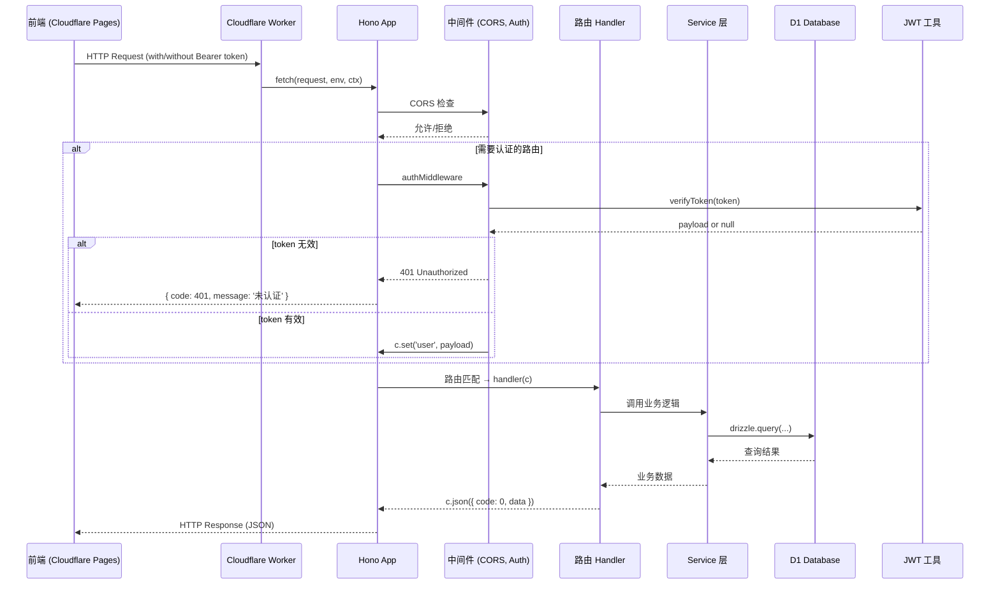
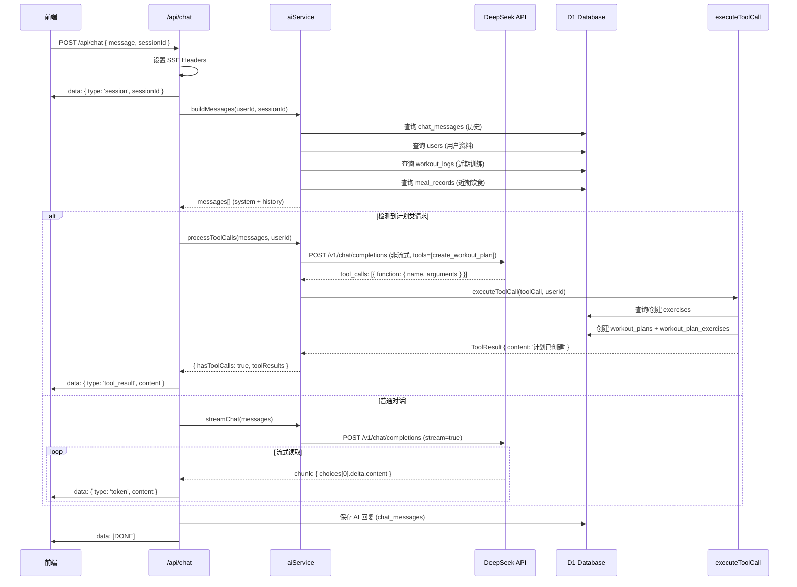
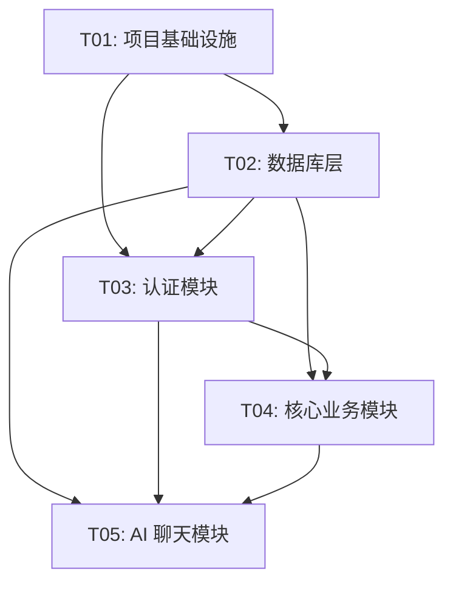

# FitMate 后端迁移架构设计

> **从 Express + Prisma + PostgreSQL 迁移到 Cloudflare Workers + Hono + D1**

---

## 第一部分：系统设计

### 1. 实现方案 + 框架选型

#### 1.1 为什么选择 Hono（而非继续用 Express）

**Hono 的优势：**
- **边缘原生**：Hono 专为边缘计算设计，在 Cloudflare Workers 上性能卓越
- **轻量级**：压缩后仅 ~14KB，适合 Workers 的脚本大小限制
- **API 兼容**：Hono 的 API 与 Express 极度相似（`app.get()`, `c.json()`, `next()` 风格中间件），迁移成本极低
- **内置 HMR**：开发体验优秀
- **多运行时支持**：同一份代码可运行在 Workers、Deno、Bun、Node.js

**为什么不使用 Express：**
- Express 依赖 Node.js 运行时，无法在 Cloudflare Workers（基于 V8 isolate）上原生运行
- 虽然可以用 `@cloudflare/express` 适配，但会损失性能且不支持所有中间件

#### 1.2 D1 数据库操作方案

**选型：Drizzle ORM（推荐）**

| 方案 | 优点 | 缺点 | 推荐度 |
|------|------|------|--------|
| 原生 SQL | 性能最佳、无抽象损耗 | 开发效率低、易出错、无类型安全 | ⭐⭐ |
| Drizzle ORM | 类型安全、轻量(~20KB)、D1 原生支持、迁移工具完善 | 学习成本 | ⭐⭐⭐⭐⭐ |
| Prisma + libSQL | 可复用现有 schema | 重量级、不适应边缘环境、需要 proxy | ⭐⭐ |

**选择 Drizzle ORM 的理由：**
1. **D1 官方推荐**：Cloudflare 文档中优先展示 Drizzle 示例
2. **边缘优化**：打包体积小，适合 Workers 限制
3. **类型安全**：类似 Prisma 的开发体验，但更轻量
4. **迁移工具**：`drizzle-kit` 支持从 Prisma schema 生成 D1 迁移文件
5. **POJO 模式**：不使用装饰器或复杂抽象，代码直观

#### 1.3 技术栈总览

```
Runtime:        Cloudflare Workers (edge)
Framework:      Hono (v4)
Database:       Cloudflare D1 (SQLite)
ORM:            Drizzle ORM (v0.30+)
Validation:     Zod (已有，继续沿用)
Auth:           JWT (jsonwebtoken → 边缘适配版本)
AI SDK:         保留 DeepSeek API 调用（fetch 原生支持）
Deploy Tool:    Wrangler (v3)
TypeScript:     Yes (strict mode)
```

---

### 2. 文件列表及相对路径

#### 2.1 需要新建的文件

```
fitmate-server/                      # 新项目根目录（Workers 项目）
├── wrangler.toml                   # Workers 配置文件（核心）
├── package.json                    # 依赖声明
├── tsconfig.json                  # TypeScript 配置
├── .env                           # 环境变量（本地开发）
├── d1/
│   ├── migrations/
│   │   ├── 0001_create_users.sql
│   │   ├── 0002_create_exercises.sql
│   │   └── ... (共 10 个迁移文件)
│   └── schema.ts                 # Drizzle schema 定义
├── src/
│   ├── index.ts                  # Workers 入口（fetch handler）
│   ├── app.ts                   # Hono 应用配置（中间件、路由挂载）
│   ├── db/
│   │   ├── index.ts            # Drizzle 实例初始化
│   │   └── seed.ts            # 种子数据（可选）
│   ├── middleware/
│   │   ├── auth.ts            # JWT 认证中间件（Hono 版本）
│   │   ├── optionalAuth.ts    # 可选认证中间件
│   │   ├── errorHandler.ts    # 全局错误处理
│   │   └── cors.ts           # CORS 配置（Hono 内置）
│   ├── routes/
│   │   ├── auth.ts            # /api/auth/* 路由
│   │   ├── exercises.ts       # /api/exercises/* 路由
│   │   ├── workoutPlans.ts   # /api/workout-plans/* 路由
│   │   ├── workoutLogs.ts     # /api/workout-logs/* 路由
│   │   ├── diet.ts            # /api/diet/* 路由
│   │   └── chat.ts            # /api/chat/* 路由（含 SSE）
│   ├── services/
│   │   ├── authService.ts     # 认证业务逻辑
│   │   ├── exerciseService.ts # 动作库业务逻辑
│   │   ├── workoutService.ts  # 训练计划/日志业务逻辑
│   │   ├── dietService.ts     # 饮食记录业务逻辑
│   │   └── aiService.ts      # AI 调用 + Function Calling
│   ├── utils/
│   │   ├── jwt.ts            # JWT 工具（边缘适配）
│   │   ├── response.ts       # 统一响应格式
│   │   └── validator.ts      # Zod → Hono 校验中间件
│   └── types/
│       └── index.ts          # 类型定义（复用原有）
└── tests/                      # 测试文件（可选）
```

#### 2.2 需要修改的文件

无（这是全新项目，不修改原有文件）

#### 2.3 需要删除的文件

无（原有 `server/` 目录保留作为备份或参考）

---

### 3. 数据结构和接口

#### 3.1 D1 数据库表结构（从 Prisma 迁移）

```sql
-- 0001_create_users.sql
CREATE TABLE users (
  id TEXT PRIMARY KEY,
  email TEXT UNIQUE NOT NULL,
  password_hash TEXT NOT NULL,
  name TEXT NOT NULL,
  height_cm REAL,
  weight_kg REAL,
  birth_date INTEGER,  -- Unix timestamp (秒)
  gender TEXT,
  goal TEXT,
  activity_level TEXT,
  created_at INTEGER NOT NULL DEFAULT (unixepoch()),
  updated_at INTEGER NOT NULL DEFAULT (unixepoch())
);

-- 0002_create_exercises.sql
CREATE TABLE exercises (
  id TEXT PRIMARY KEY,
  name TEXT NOT NULL,
  description TEXT NOT NULL DEFAULT '',
  category TEXT NOT NULL,
  muscle_group TEXT NOT NULL,
  equipment TEXT NOT NULL DEFAULT '',
  difficulty TEXT NOT NULL DEFAULT 'beginner',
  instructions TEXT NOT NULL DEFAULT '',
  image_url TEXT NOT NULL DEFAULT '',
  created_at INTEGER NOT NULL DEFAULT (unixepoch())
);

-- 0003_create_workout_plans.sql
CREATE TABLE workout_plans (
  id TEXT PRIMARY KEY,
  user_id TEXT NOT NULL,
  name TEXT NOT NULL,
  description TEXT NOT NULL DEFAULT '',
  is_template INTEGER NOT NULL DEFAULT 0,  -- SQLite 无 Boolean
  created_at INTEGER NOT NULL DEFAULT (unixepoch()),
  updated_at INTEGER NOT NULL DEFAULT (unixepoch()),
  FOREIGN KEY (user_id) REFERENCES users(id) ON DELETE CASCADE
);

-- 0004_create_workout_plan_exercises.sql
CREATE TABLE workout_plan_exercises (
  id TEXT PRIMARY KEY,
  plan_id TEXT NOT NULL,
  exercise_id TEXT NOT NULL,
  day_of_week INTEGER NOT NULL DEFAULT 0,
  sets INTEGER NOT NULL DEFAULT 3,
  reps INTEGER NOT NULL DEFAULT 10,
  duration_seconds INTEGER NOT NULL DEFAULT 0,
  rest_seconds INTEGER NOT NULL DEFAULT 60,
  sort_order INTEGER NOT NULL DEFAULT 0,
  notes TEXT NOT NULL DEFAULT '',
  FOREIGN KEY (plan_id) REFERENCES workout_plans(id) ON DELETE CASCADE,
  FOREIGN KEY (exercise_id) REFERENCES exercises(id)
);

-- 0005_create_workout_logs.sql
CREATE TABLE workout_logs (
  id TEXT PRIMARY KEY,
  user_id TEXT NOT NULL,
  plan_id TEXT,
  date INTEGER NOT NULL,
  duration_minutes INTEGER NOT NULL DEFAULT 0,
  notes TEXT NOT NULL DEFAULT '',
  created_at INTEGER NOT NULL DEFAULT (unixepoch()),
  FOREIGN KEY (user_id) REFERENCES users(id) ON DELETE CASCADE,
  FOREIGN KEY (plan_id) REFERENCES workout_plans(id) ON DELETE SET NULL
);

-- 0006_create_workout_log_exercises.sql
CREATE TABLE workout_log_exercises (
  id TEXT PRIMARY KEY,
  log_id TEXT NOT NULL,
  exercise_id TEXT NOT NULL,
  notes TEXT NOT NULL DEFAULT '',
  FOREIGN KEY (log_id) REFERENCES workout_logs(id) ON DELETE CASCADE,
  FOREIGN KEY (exercise_id) REFERENCES exercises(id)
);

-- 0007_create_workout_log_sets.sql
CREATE TABLE workout_log_sets (
  id TEXT PRIMARY KEY,
  log_exercise_id TEXT NOT NULL,
  set_number INTEGER NOT NULL,
  reps INTEGER NOT NULL,
  weight_kg REAL NOT NULL DEFAULT 0,
  FOREIGN KEY (log_exercise_id) REFERENCES workout_log_exercises(id) ON DELETE CASCADE
);

-- 0008_create_food_items.sql
CREATE TABLE food_items (
  id TEXT PRIMARY KEY,
  name TEXT NOT NULL,
  calories_per_100g REAL NOT NULL DEFAULT 0,
  protein_per_100g REAL NOT NULL DEFAULT 0,
  carbs_per_100g REAL NOT NULL DEFAULT 0,
  fat_per_100g REAL NOT NULL DEFAULT 0,
  serving_size REAL NOT NULL DEFAULT 100,
  serving_unit TEXT NOT NULL DEFAULT 'g',
  is_custom INTEGER NOT NULL DEFAULT 0,
  created_by_user_id TEXT,
  created_at INTEGER NOT NULL DEFAULT (unixepoch()),
  FOREIGN KEY (created_by_user_id) REFERENCES users(id)
);

-- 0009_create_meal_records.sql
CREATE TABLE meal_records (
  id TEXT PRIMARY KEY,
  user_id TEXT NOT NULL,
  date INTEGER NOT NULL,
  meal_type TEXT NOT NULL,
  food_item_id TEXT NOT NULL,
  quantity_grams REAL NOT NULL DEFAULT 0,
  created_at INTEGER NOT NULL DEFAULT (unixepoch()),
  FOREIGN KEY (user_id) REFERENCES users(id) ON DELETE CASCADE,
  FOREIGN KEY (food_item_id) REFERENCES food_items(id)
);

-- 0010_create_chat_sessions.sql
CREATE TABLE chat_sessions (
  id TEXT PRIMARY KEY,
  user_id TEXT NOT NULL,
  title TEXT NOT NULL DEFAULT '新对话',
  created_at INTEGER NOT NULL DEFAULT (unixepoch()),
  updated_at INTEGER NOT NULL DEFAULT (unixepoch()),
  FOREIGN KEY (user_id) REFERENCES users(id) ON DELETE CASCADE
);

-- 0011_create_chat_messages.sql
CREATE TABLE chat_messages (
  id TEXT PRIMARY KEY,
  session_id TEXT NOT NULL,
  role TEXT NOT NULL,
  content TEXT NOT NULL,
  created_at INTEGER NOT NULL DEFAULT (unixepoch()),
  FOREIGN KEY (session_id) REFERENCES chat_sessions(id) ON DELETE CASCADE
);

-- 索引优化
CREATE INDEX idx_workout_plans_user_id ON workout_plans(user_id);
CREATE INDEX idx_workout_logs_user_id ON workout_logs(user_id);
CREATE INDEX idx_chat_sessions_user_id ON chat_sessions(user_id);
CREATE INDEX idx_chat_messages_session_id ON chat_messages(session_id);
```

#### 3.2 Drizzle Schema 定义（TypeScript）

```typescript
// d1/schema.ts
import { sqliteTable, text, real, integer } from 'drizzle-orm/sqlite-core';
import { sql } from 'drizzle-orm';

export const users = sqliteTable('users', {
  id: text('id').primaryKey(),
  email: text('email').notNull().unique(),
  passwordHash: text('password_hash').notNull(),
  name: text('name').notNull(),
  heightCm: real('height_cm'),
  weightKg: real('weight_kg'),
  birthDate: integer('birth_date', { mode: 'timestamp' }),
  gender: text('gender'),
  goal: text('goal'),
  activityLevel: text('activity_level'),
  createdAt: integer('created_at', { mode: 'timestamp' }).default(sql`(unixepoch())`),
  updatedAt: integer('updated_at', { mode: 'timestamp' }).default(sql`(unixepoch())`),
});

export const exercises = sqliteTable('exercises', {
  id: text('id').primaryKey(),
  name: text('name').notNull(),
  description: text('description').notNull().default(''),
  category: text('category').notNull(),
  muscleGroup: text('muscle_group').notNull(),
  equipment: text('equipment').notNull().default(''),
  difficulty: text('difficulty').notNull().default('beginner'),
  instructions: text('instructions').notNull().default(''),
  imageUrl: text('image_url').notNull().default(''),
  createdAt: integer('created_at', { mode: 'timestamp' }).default(sql`(unixepoch())`),
});

// ... 其他表定义类似
```

#### 3.3 API 路由接口定义（从 Express 迁移到 Hono）

```typescript
// src/routes/auth.ts
import { Hono } from 'hono';
import { zValidator } from '@hono/zod-validator';
import { RegisterSchema, LoginSchema, UpdateProfileSchema } from '../types';

const authRouter = new Hono<{ Bindings: Env }>();

// POST /api/auth/register
authRouter.post('/register', zValidator('json', RegisterSchema), async (c) => {
  const data = c.req.valid('json');
  const result = await authService.register(data);
  return c.json({ code: 0, data: result, message: '注册成功' }, 201);
});

// POST /api/auth/login
authRouter.post('/login', zValidator('json', LoginSchema), async (c) => {
  const data = c.req.valid('json');
  const result = await authService.login(data);
  return c.json({ code: 0, data: result, message: '登录成功' });
});

// GET /api/auth/me
authRouter.get('/me', authMiddleware, async (c) => {
  const user = c.get('user');
  const profile = await authService.getProfile(user);
  return c.json({ code: 0, data: profile });
});

// PUT /api/auth/profile
authRouter.put('/profile', authMiddleware, zValidator('json', UpdateProfileSchema), async (c) => {
  const user = c.get('user');
  const data = c.req.valid('json');
  const updated = await authService.updateProfile(user.userId, data);
  return c.json({ code: 0, data: updated, message: '个人信息已更新' });
});

export default authRouter;
```

---

### 4. 程序调用流程

#### 4.1 请求处理流程（Cloudflare Workers 入口 → D1 查询）



#### 4.2 AI 服务调用流程（DeepSeek API + Function Calling）



---

### 5. 任务列表（有序、含依赖关系）

#### 任务分解原则
- **按功能模块分组**，不按单文件拆分
- **最大 5 个任务**（硬性上限）
- **第一个任务必须是项目基础设施**
- 任务间尽量减少线性依赖

#### 任务列表

##### **T01: 项目基础设施 + 配置**
- **文件**：
  - `wrangler.toml` - Workers 配置（D1 绑定、环境变量）
  - `package.json` - 依赖声明（hono, drizzle-orm, zod, etc.）
  - `tsconfig.json` - TypeScript 配置（target: ES2022, module: ESNext）
  - `.env` - 本地环境变量（DEEPSEEK_API_KEY, JWT_SECRET）
  - `src/index.ts` - Workers 入口（fetch handler）
  - `src/app.ts` - Hono 应用配置（CORS、路由挂载）
- **依赖**：无
- **优先级**：P0（阻塞所有其他任务）
- **说明**：搭建项目骨架，配置开发环境

##### **T02: 数据库层（D1 + Drizzle ORM）**
- **文件**：
  - `d1/schema.ts` - Drizzle schema 定义（所有表）
  - `d1/migrations/0001_create_users.sql` ~ `0011_create_chat_messages.sql` - 11 个迁移文件
  - `src/db/index.ts` - Drizzle 实例初始化（从 env.DB 获取 D1Database）
  - `src/types/index.ts` - 类型定义（复用原有，调整 PostgreSQL → D1 差异）
  - `src/utils/response.ts` - 统一响应格式（Hono 版本）
  - `src/utils/jwt.ts` - JWT 工具（使用 `jose` 库替代 `jsonwebtoken`，边缘兼容）
- **依赖**：T01
- **优先级**：P0
- **说明**：完成数据库 schema 迁移和 ORM 封装

##### **T03: 认证模块 + 用户管理**
- **文件**：
  - `src/routes/auth.ts` - 认证路由（/api/auth/*）
  - `src/services/authService.ts` - 认证业务逻辑（register, login, getProfile, updateProfile）
  - `src/middleware/auth.ts` - JWT 认证中间件（Hono 版本）
  - `src/middleware/optionalAuth.ts` - 可选认证中间件
  - `src/utils/validator.ts` - Zod → Hono 校验中间件封装
- **依赖**：T02
- **优先级**：P0
- **说明**：完成用户注册/登录/资料管理

##### **T04: 核心业务模块（训练 + 饮食 + 动作库）**
- **文件**：
  - `src/routes/exercises.ts` - 动作库路由
  - `src/routes/workoutPlans.ts` - 训练计划路由
  - `src/routes/workoutLogs.ts` - 训练日志路由
  - `src/routes/diet.ts` - 饮食记录路由（含 /food-items, /meal-records 子路由）
  - `src/services/exerciseService.ts` - 动作库业务逻辑
  - `src/services/workoutService.ts` - 训练计划/日志业务逻辑
  - `src/services/dietService.ts` - 饮食记录业务逻辑
- **依赖**：T02, T03
- **优先级**：P1
- **说明**：完成所有核心业务功能

##### **T05: AI 聊天模块 + SSE 流式响应 + 部署配置**
- **文件**：
  - `src/routes/chat.ts` - 聊天路由（含 SSE 流式响应）
  - `src/services/aiService.ts` - AI 调用 + Function Calling（完整保留原有逻辑）
  - `src/middleware/errorHandler.ts` - 全局错误处理（Hono 版本）
  - `wrangler.toml` - 更新生产环境变量（DEEPSEEK_API_KEY, JWT_SECRET）
  - `package.json` - 添加 `deploy` script
- **依赖**：T02, T03, T04
- **优先级**：P1
- **说明**：完成 AI 功能迁移和部署配置

---

### 6. 依赖包列表

#### 6.1 生产依赖（dependencies）

```json
{
  "hono": "^4.0.0",
  "@hono/zod-validator": "^0.2.0",
  "zod": "^3.23.0",
  "drizzle-orm": "^0.30.0",
  "bcryptjs": "^2.4.3",
  "jose": "^5.0.0",
  "dotenv": "^16.4.0"
}
```

**说明：**
- `hono` - Web 框架（替代 Express）
- `@hono/zod-validator` - Zod 校验中间件（替代 express-validator）
- `zod` - 保留原有校验 schema
- `drizzle-orm` - D1 ORM（替代 Prisma）
- `bcryptjs` - 密码哈希（保留原有）
- `jose` - JWT 工具（边缘兼容，替代 jsonwebtoken）
- `dotenv` - 环境变量加载（本地开发）

#### 6.2 开发依赖（devDependencies）

```json
{
  "wrangler": "^3.0.0",
  "typescript": "^5.4.0",
  "@cloudflare/workers-types": "^4.0.0",
  "drizzle-kit": "^0.20.0",
  "@types/node": "^20.12.0",
  "vitest": "^1.0.0"
}
```

**说明：**
- `wrangler` - Cloudflare Workers CLI（开发服务器 + 部署）
- `typescript` - TypeScript 编译器
- `@cloudflare/workers-types` - Workers 类型定义
- `drizzle-kit` - Drizzle 迁移工具（生成 SQL 迁移文件）
- `@types/node` - Node.js 类型定义（本地开发用）
- `vitest` - 单元测试（可选）

---

### 7. 共享知识（跨文件约定）

#### 7.1 错误处理约定

```typescript
// src/types/index.ts
export class AppError extends Error {
  constructor(
    public code: number,  // 业务错误码（对应 HTTP 状态码或自定义）
    message: string
  ) {
    super(message);
    this.name = 'AppError';
  }
}

// 错误码枚举（复用原有）
export enum ErrorCode {
  SUCCESS = 0,
  VALIDATION_ERROR = 400,
  UNAUTHORIZED = 401,
  FORBIDDEN = 403,
  NOT_FOUND = 404,
  CONFLICT = 409,
  INTERNAL_ERROR = 500,
}
```

**使用方式：**
```typescript
// 在 Service 层抛出
throw new AppError(ErrorCode.NOT_FOUND, '用户不存在');

// 在 Route 层捕获（通过 Hono 的 error handler）
app.onError((err, c) => {
  if (err instanceof AppError) {
    return c.json({ code: err.code, data: null, message: err.message }, err.code);
  }
  return c.json({ code: 500, data: null, message: '服务器内部错误' }, 500);
});
```

#### 7.2 日志记录约定

**Cloudflare Workers 环境**：
- 使用 `console.log()` / `console.error()`（自动发送到 Workers Dashboard → Logs）
- 不使用 `winston` / `pino`（增加包体积）

**日志级别约定：**
```typescript
// 开发环境：详细日志
console.log('[DEBUG] 查询用户:', userId);
console.log('[INFO] DeepSeek API 调用成功');
console.error('[ERROR] D1 查询失败:', err);

// 生产环境：仅关键日志
console.log('[INFO] 用户登录:', email);
console.error('[ERROR]', err.message);
```

#### 7.3 环境变量配置约定

**本地开发（`.env` 文件）：**
```env
# JWT
JWT_SECRET=your-secret-key-here

# DeepSeek API
DEEPSEEK_API_KEY=sk-xxx
DEEPSEEK_BASE_URL=https://api.deepseek.com

# CORS
CORS_ORIGIN=http://localhost:5173,https://fitmate.pages.dev
```

**Cloudflare Workers（通过 `wrangler.toml` 或 Dashboard 配置）：**
```toml
# wrangler.toml
[vars]
DEEPSEEK_BASE_URL = "https://api.deepseek.com"
CORS_ORIGIN = "https://fitmate.pages.dev"

[secrets]
JWT_SECRET = "your-secret-key-here"  # 通过 wrangler secret put 设置
DEEPSEEK_API_KEY = "sk-xxx"
```

**代码中读取环境变量：**
```typescript
// src/index.ts
export default {
  async fetch(request: Request, env: Env, ctx: ExecutionContext) {
    const jwtSecret = env.JWT_SECRET;
    const deepseekApiKey = env.DEEPSEEK_API_KEY;
    // ...
  }
};

// TypeScript 类型定义
type Env = {
  DB: D1Database;  // D1 数据库绑定
  JWT_SECRET: string;
  DEEPSEEK_API_KEY: string;
  DEEPSEEK_BASE_URL: string;
  CORS_ORIGIN: string;
};
```

#### 7.4 CORS 配置约定

**Hono 内置 CORS 中间件：**
```typescript
// src/app.ts
import { cors } from 'hono/cors';

app.use(
  '*',
  cors({
    origin: (origin) => {
      // 允许的前端域名列表
      const allowedOrigins = [
        'http://localhost:5173',
        'https://fitmate.pages.dev',
      ];
      if (allowedOrigins.includes(origin)) return origin;
      return null; // 拒绝
    },
    credentials: true, // 允许携带 Cookie / Authorization Header
  })
);
```

#### 7.5 SSE 流式响应约定

**Cloudflare Workers 支持 SSE（Server-Sent Events）：**
```typescript
// src/routes/chat.ts
app.post('/api/chat', async (c) => {
  const { message, sessionId } = await c.req.json();

  // 设置 SSE Headers
  const headers = new Headers();
  headers.set('Content-Type', 'text/event-stream');
  headers.set('Cache-Control', 'no-cache');
  headers.set('Connection', 'keep-alive');
  headers.set('X-Accel-Buffering', 'no');

  const stream = new ReadableStream({
    async start(controller) {
      // 1. 返回 sessionId
      controller.enqueue(`data: ${JSON.stringify({ type: 'session', sessionId })}\n\n`);

      // 2. 调用 DeepSeek API（流式）
      const response = await fetch('https://api.deepseek.com/v1/chat/completions', {
        method: 'POST',
        headers: { 'Content-Type': 'application/json', Authorization: `Bearer ${env.DEEPSEEK_API_KEY}` },
        body: JSON.stringify({ model: 'deepseek-chat', messages, stream: true }),
      });

      const reader = response.body.getReader();
      const decoder = new TextDecoder();

      while (true) {
        const { done, value } = await reader.read();
        if (done) break;

        const chunk = decoder.decode(value, { stream: true });
        const lines = chunk.split('\n').filter((line) => line.startsWith('data: '));

        for (const line of lines) {
          const data = line.slice(6).trim();
          if (data === '[DONE]') {
            controller.enqueue('data: [DONE]\n\n');
            break;
          }

          try {
            const parsed = JSON.parse(data);
            const content = parsed.choices?.[0]?.delta?.content || '';
            if (content) {
              controller.enqueue(`data: ${JSON.stringify({ type: 'token', content })}\n\n`);
            }
          } catch {
            // skip
          }
        }
      }

      controller.close();
    },
  });

  return new Response(stream, { headers });
});
```

**注意事项：**
- Workers 免费计划有 **10ms CPU 时间限制** 每个请求
- 流式响应会占用长时间连接 → 使用 `waitUntil()` 延长执行时间
- 或使用 **Workers Paid Plan**（$5/月）解除限制

---

### 8. 待明确事项

#### 8.1 无法迁移的功能

| 功能 | 原因 | 解决方案 |
|------|------|----------|
| `pgcrypto` 扩展 | D1 是 SQLite，无扩展机制 | 使用 `bcryptjs` 在应用层加密 |
| `Prisma.迁移事务` | Prisma 依赖 PostgreSQL 事务 | 使用 Drizzle Kit 生成迁移 SQL，手动管理 |
| `jsonwebtoken` | 依赖 Node.js `crypto` | 使用 `jose`（Web Crypto API 兼容） |
| `process.env` | Workers 无 `process` 对象 | 使用 `env` 对象（传入 fetch handler） |

#### 8.2 是否需要保留 PostgreSQL 作为备份

**建议：不需要**

**理由：**
1. **D1 已 GA（General Availability）**：Cloudflare D1 已正式发布，生产可用
2. **成本优势**：D1 免费额度足够小中型应用（5GB 存储、每天 500万次读取）
3. **性能优势**：D1 部署在边缘，延迟更低（vs. 集中式 PostgreSQL）
4. **简化运维**：无需要管理数据库服务器

**如果仍需备份方案：**
- 使用 **Cloudflare Durable Objects** 做实时备份
- 或定期导出 D1 数据到 R2（Cloudflare 对象存储）

#### 8.3 SSE 流式响应的 Workers 限制

**问题**：Workers 免费计划有 **10ms CPU 时间限制**，SSE 长连接可能超时

**解决方案**：
1. **升级到 Workers Paid Plan**（$5/月）→ 无 CPU 时间限制
2. **使用 `waitUntil()`** 延长后台执行时间
3. **改为轮询模式**：前端定期请求 `/api/chat/poll` 获取最新消息（牺牲实时性）

**推荐方案 1**（付费计划），因为 FitMate 是面向用户的产品，需要稳定体验。

---

## 第二部分：任务分解详细清单

### 任务依赖关系图



---

## 总结

本架构设计文档提供了从 Express + Prisma + PostgreSQL 迁移到 Cloudflare Workers + Hono + D1 的完整方案，包括：

1. **技术选型理由**（Hono + Drizzle ORM）
2. **详细文件列表**（新建文件 25+ 个）
3. **数据库 schema 迁移**（11 个 SQL 迁移文件）
4. **API 路由定义**（Hono 版本）
5. **程序调用流程**（Mermaid 时序图）
6. **任务分解**（5 个任务，按依赖关系排序）
7. **依赖包列表**（生产 + 开发依赖）
8. **共享知识**（错误处理、日志、环境变量、CORS、SSE）
9. **待明确事项**（无法迁移功能、备份方案、SSE 限制）

**下一步**：按照任务列表（T01 → T02 → T03 → T04 → T05）顺序实施迁移。
